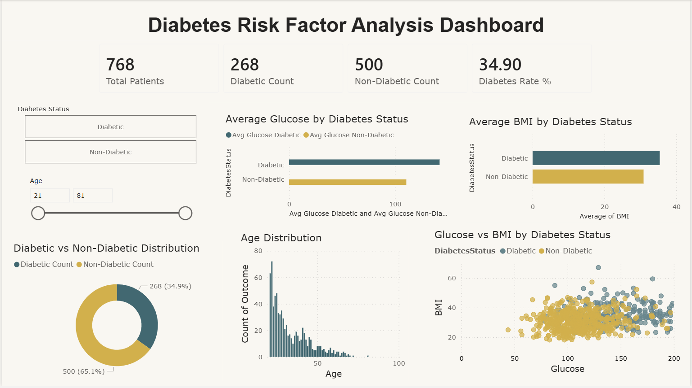

# Diabetes Risk Factor Analysis

> **DSAI3301 — Data Analysis & Visualisation Project | Spring 2026**  
> **Methodology:** Inferential Statistical Analysis  
> **Domain:** Healthcare

---

## Table of Contents

- [The Problem](#the-problem)
- [Objectives](#objectives)
- [Dataset](#dataset)
- [Project Structure](#project-structure)
- [Methodology](#methodology)
- [Key Findings](#key-findings)
- [Power BI Dashboard](#power-bi-dashboard)
- [Tools & Libraries](#tools--libraries)
- [How to Run](#how-to-run)

---

## The Problem

Clinics often screen every patient the same way — but not every risk factor carries equal weight. Without knowing which clinical measurements actually separate diabetic from non-diabetic patients, screening resources and follow-up attention get spread too thin.

**Problem Statement:**  
*Test whether Glucose, BMI, and Age significantly differ between diabetic and non-diabetic patients.*

**Why It Matters:**
- Diabetes affects ~1 in 9 adults globally and is frequently under-diagnosed until complications appear
- Early identification enables earlier intervention — diet, monitoring, medication — before disease progression
- Limited screening resources need clear priorities: knowing which factors matter most helps direct them

---

## Objectives

1. Identify and resolve data quality issues in the dataset
2. Explore distributions and correlations across all 8 clinical features
3. Test group differences using independent samples t-test and Mann-Whitney U
4. Examine categorical associations using Chi-Square test
5. Confirm significant predictors via logistic regression

---

## Dataset

**Source:** [Pima Indians Diabetes Database — Kaggle](https://www.kaggle.com/datasets/uciml/pima-indians-diabetes-database)  
**Size:** 768 patients · 9 columns  
**Class balance:** 500 Non-Diabetic (65.1%) · 268 Diabetic (34.9%)

| Column | Description |
|---|---|
| Pregnancies | Number of times pregnant |
| Glucose | Plasma glucose concentration (2-hour oral glucose tolerance test) |
| BloodPressure | Diastolic blood pressure (mm Hg) |
| SkinThickness | Triceps skinfold thickness (mm) — proxy for body fat |
| Insulin | 2-hour serum insulin (mu U/ml) |
| BMI | Body Mass Index — weight relative to height |
| DiabetesPedigreeFunction | Genetic/family history risk score |
| Age | Patient age in years |
| Outcome | Target — 1 = Diabetic, 0 = Non-Diabetic |

---

## Project Structure

```
diabetes-risk-factor-analysis/
│
├── data/
│   ├── raw/
│   │   └── diabetes.csv              # Original dataset (download from Kaggle)
│   └── processed/
│       └── diabetes_cleaned.csv      # After zero-value imputation
│
├── notebook/
│   └── diabetes_analysis.ipynb       # Full analysis notebook
│
├── figures/
│   ├── 1_boxplots_before_imputation.png
│   ├── 2_histograms_before_imputation.png
│   ├── 3_class_distribution.png
│   ├── 4_all_features_distribution.png
│   ├── 5_correlation_heatmap.png
│   ├── 6_boxplots_glucose_bmi_age.png
│   ├── 7_logistic_regression_coefficients.png
│   └── 8_chisquare_groups.png
│
└── README.md
```

> **Note:** The raw dataset is not included in this repository due to Kaggle's terms of use. Download it manually from the link above and place it at `data/raw/diabetes.csv`.

---

## Methodology

### 1. Data Cleaning

The dataset contained **biologically impossible zero values** in five columns — a living patient cannot have zero glucose or zero BMI. These were treated as missing values.

**Process:**
- Replaced zeros with `NaN` in: Glucose, BloodPressure, SkinThickness, Insulin, BMI
- Inspected distributions via boxplots and histograms **before** choosing an imputation method
- All 5 columns showed right-skew or high-end outliers → **median imputation** chosen over mean (robust to outliers regardless of skew direction)
- Insulin and SkinThickness were missing in ~50% of rows — this creates a visible spike at the median, noted as an expected limitation

### 2. Exploratory Data Analysis

- Distribution histograms across all 8 features (pre and post imputation)
- Correlation heatmap to identify feature relationships
- Grouped boxplots comparing Glucose, BMI, and Age between diabetic and non-diabetic groups

### 3. Inferential Statistical Analysis

#### Independent Samples t-test
Compares the **mean** of each continuous variable between two independent groups (diabetic vs non-diabetic).

**Assumption:** roughly normally distributed data.

#### Mann-Whitney U Test
Non-parametric alternative — compares **rank distributions** rather than means. Makes no normality assumption. Run as confirmation: if both t-test and Mann-Whitney agree, the conclusion is statistically robust regardless of distribution shape.

#### Chi-Square Test
Tests the association between two **categorical** variables. Since Glucose, BMI, and Age are continuous, they were first binned into clinically recognised categories:

| Variable | Bins | Source |
|---|---|---|
| Glucose | Normal (<100) / Pre-Diabetic (100-125) / Diabetic Range (>125) | Clinical standard |
| BMI | Underweight / Normal / Overweight / Obese | WHO classification |
| Age | Young (21-35) / Middle (36-50) / Older (51+) | Clinical screening bands |

#### Logistic Regression
Identifies which variables remain significant predictors of diabetes outcome when **all variables compete together** (multivariate analysis), not just one at a time.

---

## Key Findings

### Hypothesis Test Results

| Variable | t-test p-value | Mann-Whitney p-value | Decision |
|---|---|---|---|
| Glucose | < 0.0001 | < 0.0001 | Reject H₀ |
| BMI | < 0.0001 | < 0.0001 | Reject H₀ |
| Age | < 0.0001 | < 0.0001 | Reject H₀ |

**All three variables significantly differ between diabetic and non-diabetic patients (p < 0.0001).**


### Chi-Square Test Results

| Variable | Chi-Square | p-value | Decision |
|---|---|---|---|
| Glucose | 147.91 | < 0.0001 | Reject H₀ |
| BMI | 147.91 | < 0.0001 | Reject H₀ |
| Age | 46.76 | < 0.0001 | Reject H₀ |

**Key patterns from contingency tables:**
- **Glucose:** Only 14 of 192 patients in the Normal range were diabetic (7.3%) vs 176 of 297 in the Diabetic Range (59.3%) — the sharpest categorical split
- **BMI:** Diabetic patients cluster heavily in the Obese category (221 of 483 obese patients vs 40 of 179 overweight)
- **Age:** Young group is 3:1 non-diabetic vs diabetic — by Middle age the split is nearly equal (90 vs 99)


### Per-Variable Summary

**Glucose — Strongest differentiator**
- t = 15.67 · r = 0.49 with Outcome
- Most significant predictor in logistic regression (p < 0.0001, coef = 0.038)
- Diabetic patients consistently have higher glucose levels

**BMI — Moderate differentiator**
- t = 9.09 · r = 0.31 with Outcome
- Consistently significant across all tests
- Diabetic patients trend toward higher BMI

**Age — Significant in isolation**
- t = 6.79 · r = 0.24 with Outcome
- Significant in t-test and Mann-Whitney U (p < 0.0001)
- Becomes **insignificant in logistic regression** (p = 0.171) — absorbed by Pregnancies (r = 0.54 with Age)
- This illustrates the difference between univariate and multivariate analysis

### Logistic Regression — Significant Predictors

| Variable | p-value | Coefficient |
|---|---|---|
| Glucose | < 0.0001 | 0.038 |
| BMI | < 0.0001 | 0.094 |
| Pregnancies | < 0.0001 | 0.125 |
| DiabetesPedigreeFunction | 0.003 | 0.876 |

**Pseudo R² = 0.28** — the model explains ~28% of variance in diabetes outcome.

> **Note on coefficient size:** DiabetesPedigreeFunction's large coefficient (0.876) doesn't mean it's the most impactful predictor — it operates on a much smaller scale (0.07–2.4) compared to Glucose (44–199). Statistical significance (p-value) is a more reliable indicator of importance than coefficient magnitude alone.

### Business Takeaway
> If a clinic has to prioritize one measurement in resource-limited screening, **Glucose offers the highest diagnostic value** of the three — it is the strongest differentiator across every analytical method used in this project. Notably, only 7.3% of patients with normal glucose levels were diabetic, compared to 59.3% in the diabetic glucose range — a clinically actionable threshold.

---

## Power BI Dashboard

An interactive dashboard was built in Power BI to communicate findings to three stakeholder groups:



| Stakeholder | What They Use |
|---|---|
| Clinic Administrators | KPI cards (total patients, diabetic count, diabetes rate %) to assess screening scale |
| Clinicians / Doctors | Average Glucose & BMI by status — benchmarks for individual patient comparison |
| Public Health Planners | Age distribution and Glucose vs BMI scatter — population-level pattern identification |

**Dashboard Features:**
- 4 KPI Cards — Total Patients, Diabetic Count, Non-Diabetic Count, Diabetes Rate %
- Donut chart — diabetic vs non-diabetic distribution
- Average Glucose by Diabetes Status (bar chart)
- Average BMI by Diabetes Status (bar chart)
- Glucose vs BMI scatter plot colored by diabetes status
- Age distribution histogram
- 2 interactive slicers — Diabetes Status filter & Age range slider (cross-filter all visuals)

**Advanced DAX Measures (8 custom measures):**
```
Total Patients         = COUNTROWS(DiabetesData)
Diabetic Count         = CALCULATE(COUNTROWS(DiabetesData), DiabetesData[Outcome] = 1)
Non-Diabetic Count     = CALCULATE(COUNTROWS(DiabetesData), DiabetesData[Outcome] = 0)
Diabetes Rate %        = DIVIDE([Diabetic Count], [Total Patients]) * 100
Avg Glucose Diabetic   = CALCULATE(AVERAGE(DiabetesData[Glucose]), DiabetesData[Outcome] = 1)
Avg Glucose Non-Diab   = CALCULATE(AVERAGE(DiabetesData[Glucose]), DiabetesData[Outcome] = 0)
Avg BMI Diabetic       = CALCULATE(AVERAGE(DiabetesData[BMI]), DiabetesData[Outcome] = 1)
Avg Age Diabetic       = CALCULATE(AVERAGE(DiabetesData[Age]), DiabetesData[Outcome] = 1)
```

---

## Tools & Libraries

| Tool | Purpose |
|---|---|
| Python 3 | Core analysis language |
| pandas | Data loading, cleaning, manipulation |
| numpy | Numerical operations, NaN handling |
| matplotlib | Base plotting |
| seaborn | Statistical visualizations |
| scipy.stats | t-test, Mann-Whitney U, Chi-Square |
| statsmodels | Logistic regression with full statistical output |
| Jupyter Notebook | Interactive analysis environment |
| Power BI Desktop | Interactive dashboard |

---

## How to Run

**1. Clone the repository**
```bash
git clone https://github.com/Maymona-M/diabetes-risk-factor-analysis.git
cd diabetes-risk-factor-analysis
```

**2. Install dependencies**
```bash
pip install pandas numpy matplotlib seaborn scipy statsmodels scikit-learn jupyter
```

**3. Download the dataset**

Download `diabetes.csv` from [Kaggle](https://www.kaggle.com/datasets/uciml/pima-indians-diabetes-database) and place it at:
```
data/raw/diabetes.csv
```

**4. Run the notebook**
```bash
jupyter notebook notebook/diabetes_analysis.ipynb
```

Run all cells top to bottom. The cleaned dataset will be saved automatically to `data/processed/diabetes_cleaned.csv` and all figures to the `figures/` folder.

---

*DSAI3301 — Data Analysis & Visualisation | Spring 2026 | University of Doha for Science and Technology*
